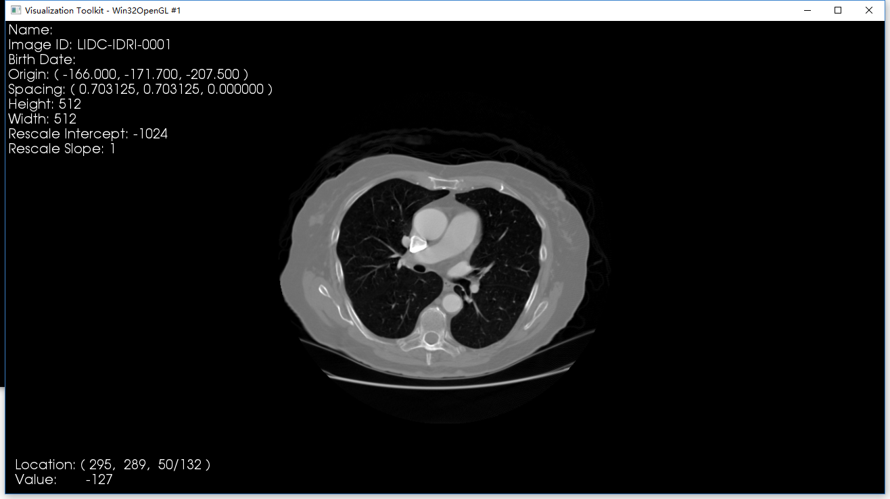

# MhdViewer
A basic medical image (mhd) viewer based on VTK and DCMTK library

## Configuration
* `platform`: Windows 10 x64 version 1709
* `Visual Studio`: 2017 Professional
* `VTK`: 8.0.0
* `DCMTK`: 3.6.2+DEV

## Compile

### Step 1: Compile VTK Library

**DEBUG** or **RELEASE** mode.

### Step 2: Compile DCMTK Library

**DEBUG** or **RELEASE** mode.

### Step 3: Compile Project

**DEBUG**

| Setting | Items |
|---------|-------|
|`VC++ Directories->Including Directories(包含目录)`| F:\Program Files (x86)\VTK_DEBUG\include\vtk-8.0   F:\Program Files (x86)\DCMTK\include\|
|`VC++ Directories->Library Directories(库目录)`| F:\Program Files (x86)\VTK_DEBUG\lib\   F:\Program Files (x86)\DCMTK\lib\|
|`Linker->Input->Additional Dependencies(附加依赖项)`| charls.lib  cmr.lib  dcmdata.lib  dcmdsig.lib  dcmfg.lib  dcmimage.lib  dcmimgle.lib  dcmiod.lib  dcmjpeg.lib  dcmjpls.lib  dcmnet.lib  dcmpmap.lib  dcmpstat.lib  dcmqrdb.lib  dcmrt.lib  dcmseg.lib  dcmsr.lib  dcmtls.lib  dcmtract.lib  dcmwlm.lib  i2d.lib  ijg12.lib  ijg16.lib  ijg8.lib  oflog.lib  ofstd.lib |

*Note:* Keep the same compile mode (DEBUG or RELEASE) for VTK, DCMTK and current project. 
*Note 2:* VTK libraries are added in `vtk_lib.h`

**RELEASE**
Omit... 

*Note:* In `VTKdemo2.cpp`, instead of including `vtk_lib.h`, I add those libriries in `Linker->Input->Additional Dependencies`.

## Description

`VTKdemo.cpp` is the first edition of this project. It can open and display `.mhd` and `.dcm` files. This edition shows images just using VTK library, so it can easily read `.mhd` files. However, it can just read **single** series in one study (dicom).

`VTKdemo2.cpp` is the second edition of this project. I introduced DCMTK library which can process multi-series study and compressed dicom images. `myDicomImageReader.cpp/.h` is the core code to read compressed or multi-series dicom images.

`install.bat` is a processing batch, used to install VTK_demo.exe to system register table. After installation, you can open `.mhd` file according to double click and open `.dcm` folder with the item `Open with CTViewer` in context menu.

## Display 

